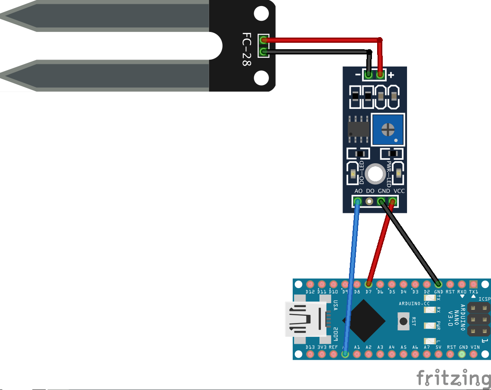
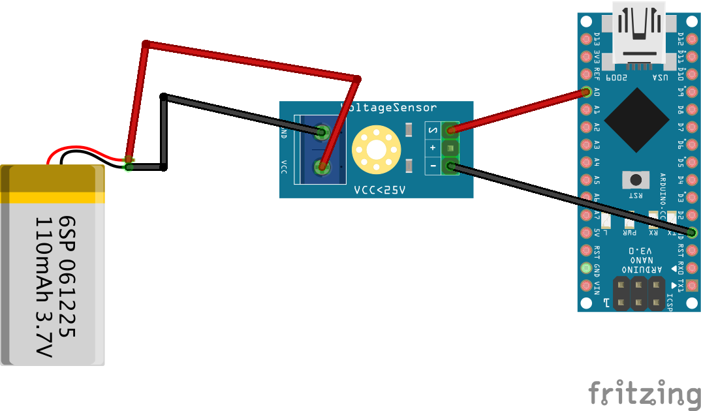
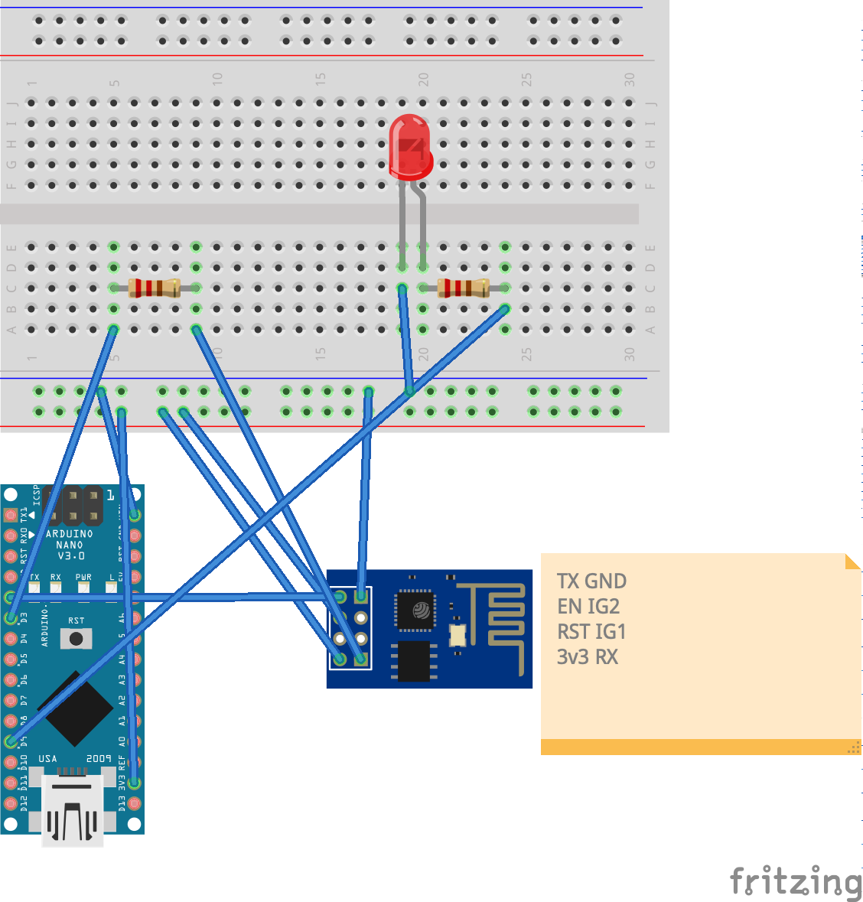
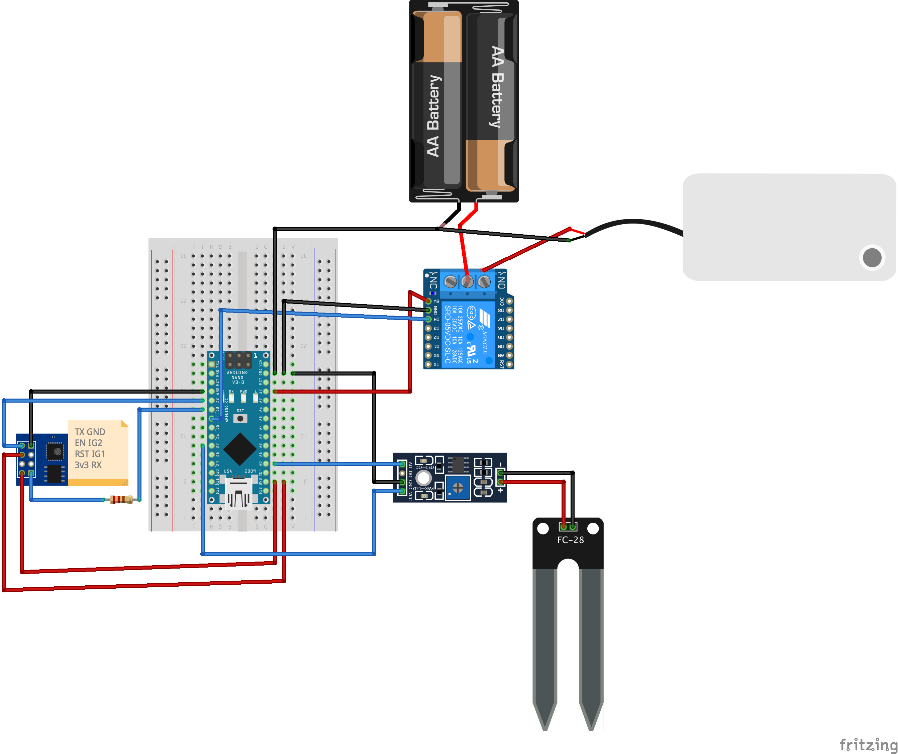

# Arduino Smart Watering System

This project is the firmware and software for a smart plant watering system based on Arduino Nano, Spring Boot backend, and Angular frontend.

## Hardware
- Arduino Nano
- YL-69 soil moisture sensor (tested and working)
- 5V water pump with relay
- Power supply: 4×AAA batteries
- ESP-01S Wi-Fi module (planned)

## Firmware
- A reset project for resetting the Arduino is available in:
  [reset](reset/reset.ino)
- A test project for the YL-69 soil moisture sensor is available in: [moisture_sensor](moisture_sensor/moisture_sensor_test.ino)
  - Schema: 
- A project for measuring input voltage using a sensor is available in (use port A0 because the other analog inputs are floating):
[voltage_sensor](voltage_measurement_sensor/voltage_measurement_sensor.ino)
  - Schema: 
- A project fot testing the wi-fi module ESP-01S is available in: [wifi-module](wifi-module/wifi-module.ino)
  - Schema: 
- A project for testing the wi-fi module ESP-01S with RemoteXY requests is available in: [wifi-module-with-remotexy](wifi-module-with-remotexy/wifi-module-with-remotexy.ino)
- The project's core schema: 